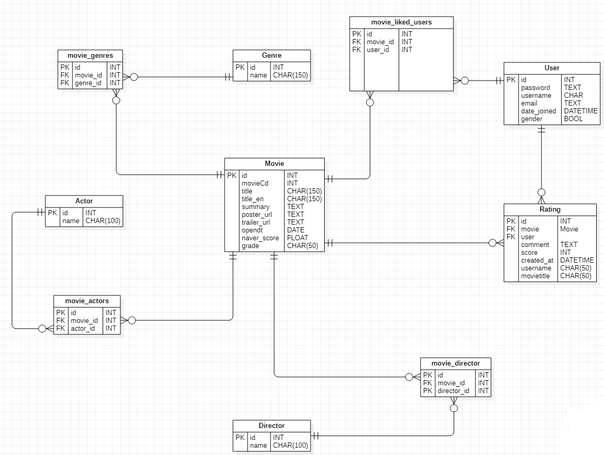

# Movie_Recommendation


## i. 팀원 정보 및 업무 분담 내역

- 강희원 : vue 구현, api crud 구현

- 윤성민 : 데이터베이스 구축, vue 구현

## ii. 목표 서비스 구현 및 실제 구현 정도 (가능하다면 일자별 업무 진행 정도 포함)

- 영화 상세 보기 페이지  구현

- 회원 가입 , 내 정보 수정, 로그인, 로그아웃, 회원탈퇴 로직 구현

- 좋아하는 영화와 쓴 댓글을 볼 수 있는 내 정보 페이지 구현

- Many to Many 필드를 활용하여 검색 기능 구현

- 키워드의 일부만 일치하여도 검색결과가 나올 수 있게 구현


## iii. 데이터베이스 모델링(ERD)



## iv. 핵심 기능

- 영화배우, 감독, 제목별 검색
- 최신순, 네이버 평점순, 좋아요순 정렬


## v. 배포 서버 URL

```
https://jokerst-movie-vue.firebaseapp.com/
```


## vi. 기타 (느낀점)

- 강희원 :  vue를 구현하면서 component, probs 등에 익숙해질 수 있었고,  single page application을 경험할수 있었다.

- 윤성민 :  데이터 베이스를 구축하면서 dumpdata 와 loaddata의 소중함을 느낄 수 있었다.

